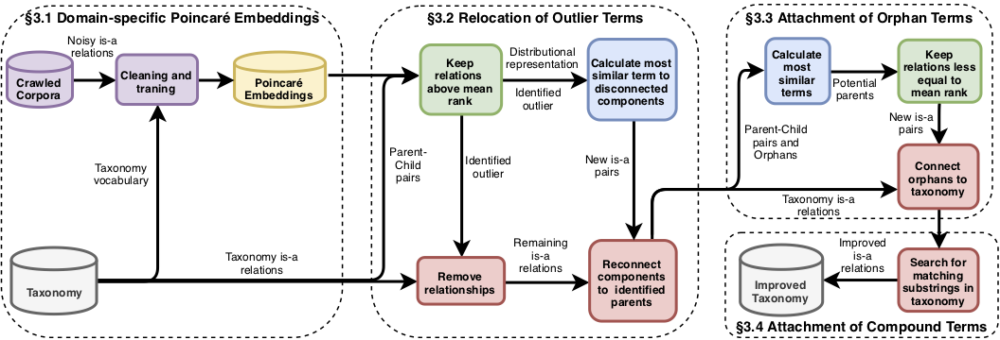

# A Taxonomy Refinement Algorithm Based on Hyperbolic Term Embeddings

We introduce the use of Poincaré embeddings to improve existing state-of-the-art approaches to domain-specific taxonomy induction from text as a signal for both relocating wrong hyponym terms within a (pre-induced) taxonomy as well as for attaching disconnected terms in a taxonomy. This method substantially improves previous state-of-the-art results on the SemEval-2016 Task 13 on taxonomy extraction. We demonstrate the superiority of Poincaré embeddings over distributional semantic representations, supporting the hypothesis that they can better capture hierarchical lexical-semantic relationships than embeddings in the Euclidean space.

The method implemented in this repository is described in the following scientific publication:

  *Rami Aly, Shantanu Acharya, Alexander Ossa, Arne Köhn, Chris Biemann, Alexander Panchenko (2019): **[Every Child Should Have Parents: A Taxonomy Refinement Algorithm Based on Hyperbolic Term Embeddings](https://aclweb.org/anthology/papers/P/P19/P19-1474/
)**. In Proceedings of the 57th Annual Meeting of the Association for Computational Linguistics. Florence, Italy. Association for Computational Linguistics*

 The overview of the method is presented in the figure below:



If you use the code in this repository, e.g. as a baseline in your experiment or simply want to refer to this work, we kindly ask you to use the following citation:

```
@inproceedings{aly-etal-2019-every,
    title = "Every Child Should Have Parents: A Taxonomy Refinement Algorithm Based on Hyperbolic Term Embeddings",
    author = {Aly, Rami  and
      Acharya, Shantanu  and
      Ossa, Alexander  and
      K{\"o}hn, Arne  and
      Biemann, Chris  and
      Panchenko, Alexander},
    booktitle = "Proceedings of the 57th Annual Meeting of the Association for Computational Linguistics",
    month = jul,
    year = "2019",
    address = "Florence, Italy",
    publisher = "Association for Computational Linguistics",
    url = "https://www.aclweb.org/anthology/P19-1474",
    pages = "4811--4817"
}
```

The figure below shows summary of the results of our approach on the SemEval 2016 Task 13 dataset on taxonomy extraction from text. Given a partially completed taxonomy, such as generated by the TAXI or the USAAR methods (which were leading participants in the SemEval competition) our method is able to further imporve the results by applying postprocessing based on the hyperbolic embeddings:


# System requirements

The system was tested on Ubuntu Linux, however there are no C/C++ based custom extension and thus it should normally run on the other operating systems as well.

# Installation 

1. Clone repository: 

  ```
  git clone https://github.com/Taxonomy_Refinement_Embeddings.git
  ```
2. Download resources into the repository (1.4G compressed by zip) and extract them:

  ```
  cd Taxonomy_Refinement_Embeddings && wget http://ltdata1.informatik.uni-hamburg.de/taxonomy_refinement/data.zip
  ```
 
3. Install all needed dependencies (requirements.txt soon to be released)

4. Setup spaCy. Download the language models for English, Dutch, French and Italian
  ```
  $ python -m spacy download en
  $ python -m spacy download nl
  $ python -m spacy download fr
  $ python -m spacy download it
  ```
  
# Refinement of exisiting taxonomies

Our experiments were done on 3 different system submissions to the [2016 shared task on taxonomy extraction](http://alt.qcri.org/semeval2016/task13/) for all 4 languages of the task (English, French, Italian, Dutch).

To reproduce the results of our experiments first create the training data for the Poincaré embeddings:
```
python data_loader.py --lang=EN
```
Make sure that the downloaded data is extracted and in the same folder as the `data_loader.py`.

Next, train the Poincaré embeddings for the specific language:
```
python3 train_embeddings.py --mode=train_poincare_custom --lang=EN
```
Alternatively, models can be trained using wordnet data. In this case, select the mode `train_poincare_wordnet`. For word2vec select the mode `train_word2vec`.

Finally, employ the refinement pipeline, specifying the system that should be refined, the refinement method and the language:
```
./run.sh TAXI environment EN 3
```
Select a system from: `TAXI`, `USAAR`, `JUNLP`.
The shared task consisted of three different domains: `environment`, `science`, `food`.
The languages are `EN`, `FR`, `IT`, `NL`.
There are 4 different refinement methods available:

`0`: Connect every disconnected term to the root of the taxonomy.

`1`: Employ word2vec embeddings to refine taxonomy. (embeddings have to be learned beforehand, see above)

`2`: Employ Poincaré embeddings trained on wordnet data to refine taxonomy.

`3`: Employ Poincaré trained on noisy relations extracted from general and domain-specifc corpora to refine taxonomy.


